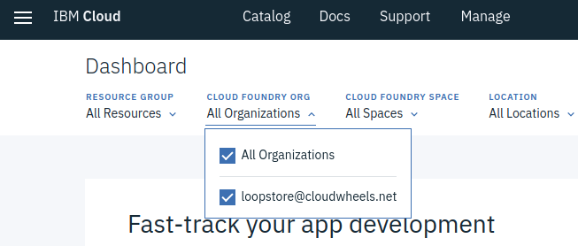
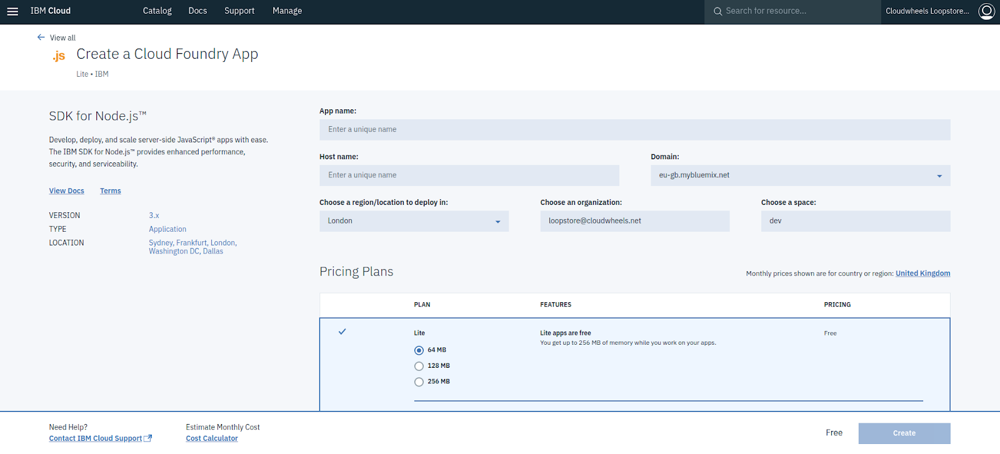
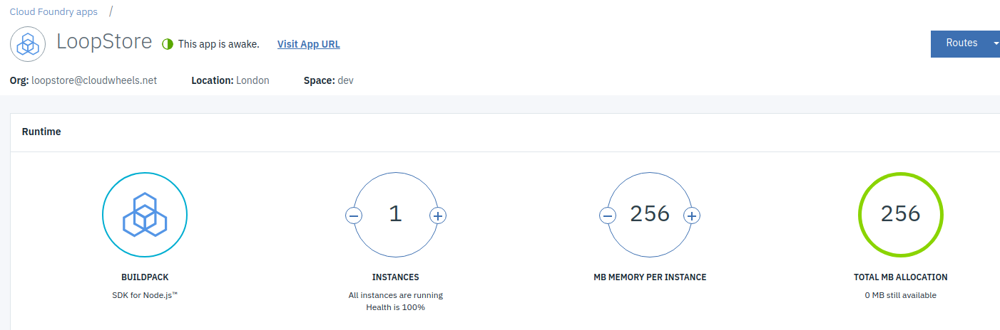

# Deploy your LoopStore to IBM Cloud free tier

[Codelab Feedback](https://github.com/loopstore/loopstore-tutorial-v4/issues)

## Introduction
Duration: 01:00

In this HOW-TO section we'll be creating a free tier IBM Cloud account and setting up Cloud Foundry app instance for deploying our LoopStore.

We'll install and configure the IBM Cloud CLI for deploying our app..

We'll also set up a Cloudant database service and update the code so we can use it to persist data for our  [Models](https://loopback.io/doc/en/lb4/Model.html). 

## Why use IBM Cloud?
Duration: 01:00

LoopBack apps can be hosted in any  [Node.js](https://nodejs.org/) environment and connect to a wide variety of data  sources. 

[IBM Cloud](https://www.ibm.com/cloud/) is a convenient option for getting our LoopStore up and running on the web. It offers full-stack cloud platform with over 170 products and services. It also offers a useful free tier to give developers a chance to explore, with no need to enter credit card details.

All you really need is an email address to confirm your registration, a first and last name and your region to create an IBM id.

That'll get us 256MB of memory on IBM's  [Cloud Foundry](https://www.cloudfoundry.org/the-foundry/ibm-cloud-foundry/) platform, where we'll set up a vanilla  [Node.js](https://nodejs.org/) instance for deploying our LoopStore app to the cloud.

As a big bonus, our IBM id gives us access to the  [Cloudant](https://www.ibm.com/cloud/cloudant) database service. We can connect to all sorts of backend data services through LoopBack's  [DataSources](https://loopback.io/doc/en/lb4/DataSources.html). Cloudant is a distributed, non-relational document database (a bit like  [MongoDB](https://www.mongodb.com/)), which suits storing data for our LoopBack  [Models](https://loopback.io/doc/en/lb4/Model.html) well. 

## Sign up for IBM Cloud and login to the console
Duration: 02:00

Fill in your email, name, region  [IBM Cloud signup page](https://console.bluemix.net/registration/) and once you've responded to the confirmation email and logged in you should end up with a lovely welcome message.

**Welcome to IBM Cloud!**

Note that the welcome message tells you that your account is all set up with a:

* **resource group**;
* **org**, and;
* **space**

You'll need to know some of these to configure the CLI. 

Once you've dismissed this message, you'll find yourself on your  [IBM Cloud Dashboard](https://console.bluemix.net/dashboard/apps).

Wondering why the console (and soon our LoopStore) are hosted at bluemix.net? - IBM Cloud  [changed its name from Bluemix in 2017](https://www.ibm.com/blogs/bluemix/2017/10/bluemix-is-now-ibm-cloud/)

You can see from the dropdowns at the top of the Dashboard that your **organisation** has been created using your **email address**, and there is a single **space **called **dev.**

**These are the default settings that will be used when you create your Cloud Foundry app you will need them to configure the CLI.**

Hit the hamburger top-left and you'll meet the side menu that allows you to find your way around the vast IBM Cloud platform.

## Create a Node.js SDK app instance on Cloud Foundry
Duration: 02:00

You can use the side menu to jump to the Cloud Foundry overview page. Our LoopStore will live in the  [Public](https://console.bluemix.net/dashboard/cloudfoundry?filter=cf_public) section. 

Click on   

You'll end on the  [Catalog](https://console.bluemix.net/catalog/) page (alternatively, you could have just clicked on  [Catalog](https://console.bluemix.net/catalog/) on the top menu).

You now have a chance to see the full range of IBM Cloud tools and services. 

Try not to get distracted by the really cool kids like  [Watson](https://console.bluemix.net/developer/watson/dashboard) just for the moment: what we want is an **SDK for Node.js **Cloud Foundry App. Click on it to get the configuration page.

Let's take a closer look:

**App name**: Set this as **loopstore** to match the rest of the tutorial instructions, or chose your own name: you will configure the CLI to deploy to an app instance with this name.

**Domain**: When you deploy with the CLI, this is the value you will need to give as the **API Endpoint**

**Host name: **Together with the **Domain** this forms the URL our LoopStore will be served from. You will need to choose something unique. You don't need to know this to configure the CLI, just to connect once the app is up and running. In the tutorial we'll refer it it as **[my-hostname].**

**Choose a region to deploy in**: This will default to the region you chose when you signed up.

**Choose an organisation and space**: These will be your IBM id **email address **and the **dev **space, needed to configure the CLI as we noted on the Dashboard previously.

**Pricing Plans**: As promised, we're working with the worry free Lite tier: there's no possibility the app will generate charges. 

We've got a total of 256MB of memory which we could share with other other app instances but for now we may as well just give our LoopStore the full quota, so select the **256MB option**.

That's about it! 

Press create and (provided **[my-hostname]** is available) the platform will start spinning up the Node.js environment. 

It's an asynchronous process and can take a few minutes, so you can carry on to the next step of setting up a Cloudant service to store or data. 

If you wait a while or come back to this page later, you should see that the app is "awake". We can also check the status of the app using the CLI as we'll see later.

## Set up a Cloudant database and note the connection string
Duration: 01:00

## Install & configure the ?IBM Cloud CLI
Duration: 01:00

* Login (set org, space, API endpoint)
* Get app manifest
* Inspect service status

That's our IBM Cloud environment and database all set up and we're almost ready to deploy, but we need to make a few changes to our LoopStore's app code first. 

## Manage Cloud Foundry environment variables with cfenv
Duration: 01:00

Add 

## Configure the DataSource in data.db to use loopback-connector-cloudant
Duration: 01:00

## Deploy LoopStore to the cloud!
Duration: 01:00

## Test your deployment
Duration: 01:00

## Setting up a local Cloudant database
Duration: 01:00

## Considerations for production deployment
Duration: 01:00

